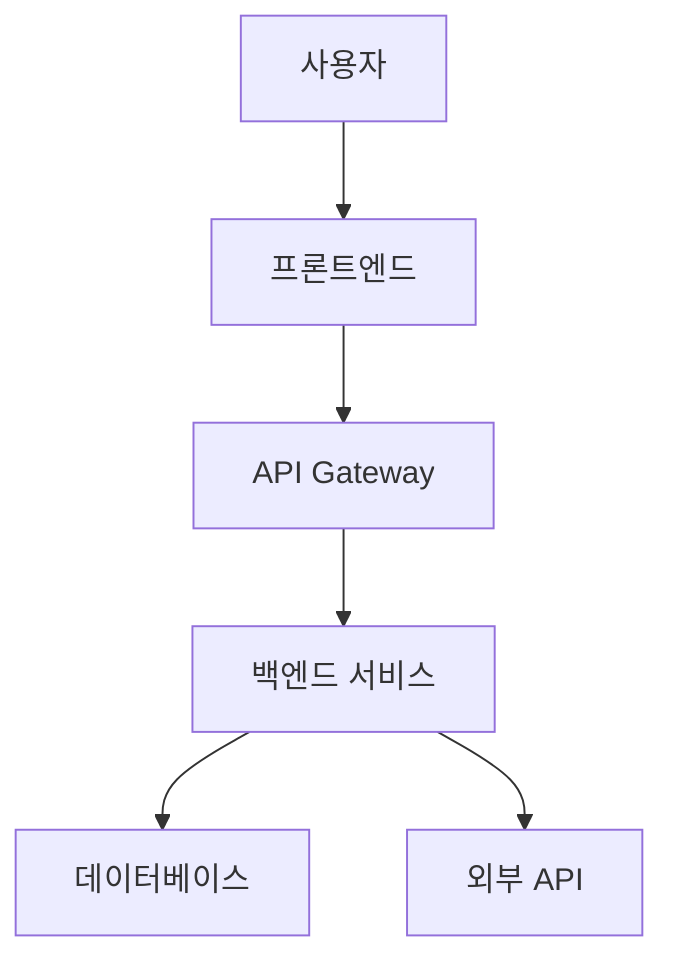

# Acuzen ICBM 시스템 아키텍처

## 1. 개요 (Overview)

Acuzen ICBM 프로젝트의 전체적인 시스템 아키텍처를 설명합니다.

## 2. 시스템 구성요소 (System Components)

### 2.1 프론트엔드 (Frontend)
- **기술 스택**: React.js / Vue.js
- **역할**: 사용자 인터페이스 제공
- **특징**: 반응형 디자인, SPA 구조

### 2.2 백엔드 (Backend)
- **기술 스택**: Node.js / Python Flask/Django
- **역할**: 비즈니스 로직 처리, API 제공
- **특징**: RESTful API, 마이크로서비스 아키텍처

### 2.3 데이터베이스 (Database)
- **주 데이터베이스**: PostgreSQL / MongoDB
- **캐시**: Redis
- **역할**: 데이터 저장 및 관리

### 2.4 외부 서비스 (External Services)
- **클라우드**: AWS / GCP
- **모니터링**: Grafana, Prometheus
- **CI/CD**: GitHub Actions

## 3. 데이터 플로우 (Data Flow)

## 4. 보안 고려사항 (Security Considerations)

- JWT 기반 인증
- HTTPS 통신
- API rate limiting
- 데이터 암호화

## 5. 확장성 (Scalability)

- 수평적 확장 지원
- 로드 밸런싱
- 캐싱 전략
- CDN 활용

## 6. 모니터링 및 로깅 (Monitoring & Logging)

- 실시간 모니터링
- 구조화된 로깅
- 알림 시스템
- 성능 메트릭 수집